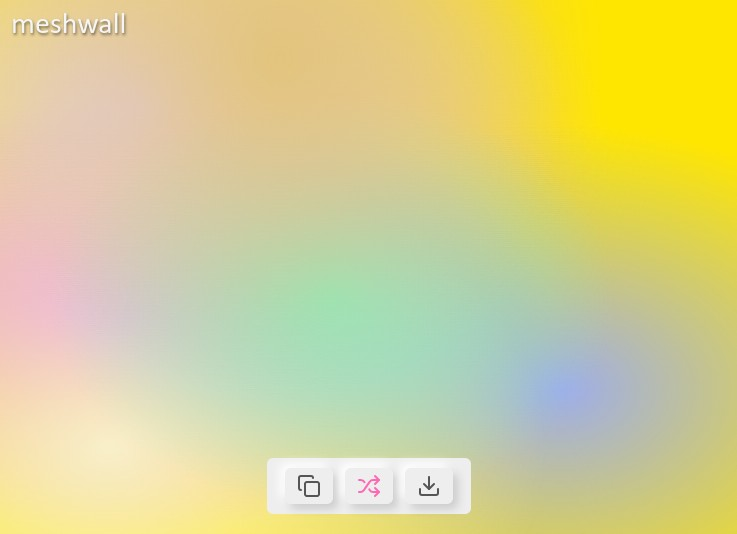

## Meshwall

Это простой генератор обоев сетчатого градиента на случай если вам вдруг понадобилось

### Как пользоваться

1. Заходите на сайт [meshwall.vercel.app](https://meshwall.vercel.app/)
2. Кликаете на кнопку "Shuffle" посередине, пока картинка не станет радовать глаз
3. Нажимаете "Скопировать", если нужен код CSS, или "Скачать" в формате .png
4. Done!

Картинка сохраняется с разрешением экрана вашего девайса - ни больше, ни меньше.

